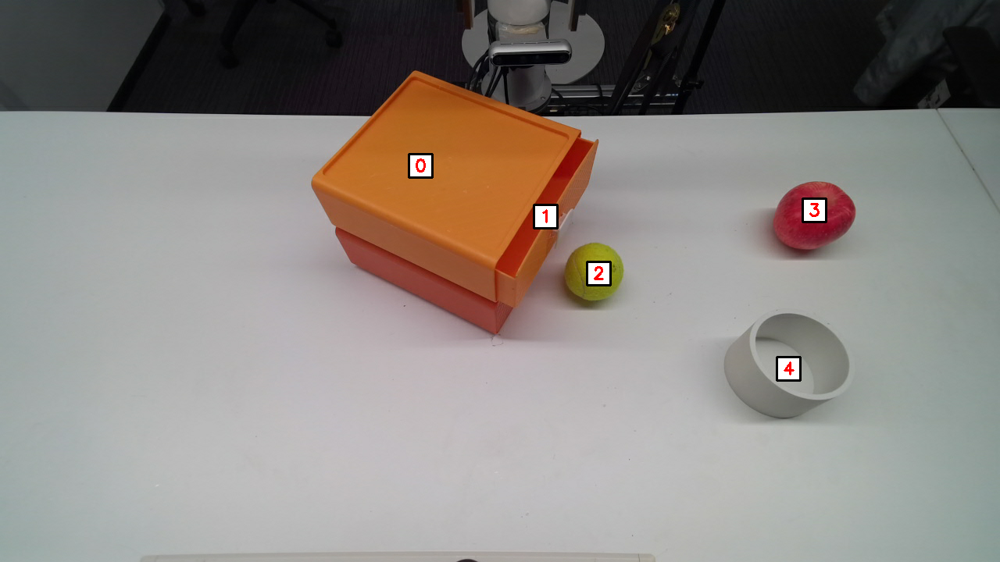

# REAL WORLD EXPERIMENT

**This repository is still under refinement and currently being updated**❗❗❗


Because replicating identical real-world conditions can be challenging, we only provide our experimental code and environment configuration as reference.

## Prerequisites

Before running the real-world experiments, ensure the following environments are properly installed:

* **[ROS 2 Humble](https://docs.ros.org/en/humble/index.html)**
* **[Azure Kinect SDK](https://github.com/microsoft/Azure_Kinect_ROS_Driver/tree/humble)**
* **[XArm6 Driver](https://github.com/xArm-Developer/xarm_ros2?tab=readme-ov-file)**

The main program environment can directly reuse the **simworld environment** created in
[`README_SIM`](../simworld/README_SIM.md).


## Running Real-World Experiments

Follow the steps below to start all required modules and execute a task.

#### 1. Launch Azure Kinect SDK

Open a terminal and run:

```bash
ros2 launch azure_kinect_ros_driver driver.launch.py
```

---

#### 2. Activate SoM environment and extract masks

Open another terminal:

```bash
conda activate som
python som_gpt4v/main_som.py grasp
```

---

#### 3. Start AnyGrasp for grasp pose computation (ROS topic communication)

Open a new terminal:

```bash
python detector_ros.py
```

---

#### 4. Start TAPNet point tracking (ROS topic communication)

Open another terminal:

```bash
cd ./point_tracker
python point_track_ros.py
```

---

### 5. Run the corresponding task program

Finally, open a terminal, activate the simulation environment, and execute the task:

```bash
conda activate simworld
python short_1.py
```

Replace `short_1.py` with any task program you wish to run.

---
**Additional Note on Program Startup**

After launching the program, a window will first appear. You should use the mouse to select several points **according to the sequence and quantity specified by the program and plan**. These points serve as keypoints for the subsequent processing. Once you finish selecting the keypoints, press q to exit the window. The following procedures will automatically use these keypoints to **compute grasp poses or placement positions**.


---

> We thank Cindy Wang and Mingkang Zhang for their assistance during the real-robot debugging and programming process.
> For any questions, please contact: **[2604317843xwj@gmail.com](mailto:2604317843xwj@gmail.com)**, **[cindy.w0135@gmail.com](mailto:cindy.w0135@gmail.com)**, or **[zmk59478@gmail.com](mailto:zmk59478@gmail.com)**.


 **This part of the repository is adapted from [Enhanced_ReKep4xarm](https://github.com/youngfriday/Enhanced_ReKep4xarm/).**